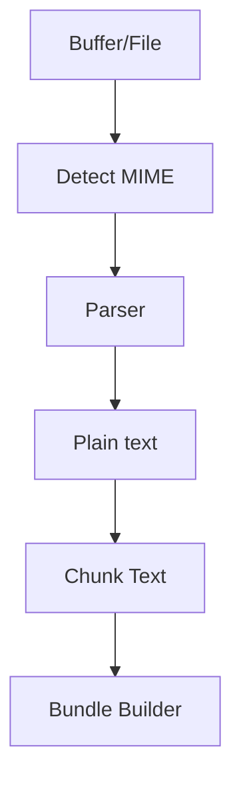

# MixContext‑Core · Workflows

## Parsing Pipeline

### Steps

1. **Detect** mime via `file-type`.
2. **Parser** returns raw text + meta.
3. **Chunk** splits ~3 000 chars.
4. **Bundle** zips `mixcontext.json` + originals.

## Release

1. `changeset version` → bump semver.
2. `pnpm build` → dist.
3. GitHub Action publishes to npm on `main` tag.
