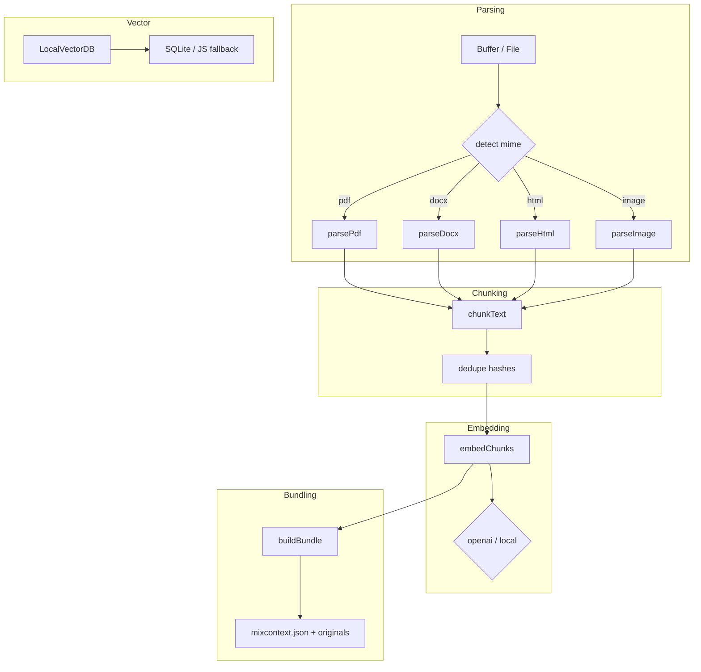

# MixContext-Core

[](https://www.npmjs.com/package/@mixcontext/core)
[](https://github.com/mixcontext/mixcontext-core/actions/workflows/ci.yml)
[](https://codecov.io/gh/mixcontext/mixcontext-core)
[](LICENSE)


[API Docs ↗︎](https://mixcontext.github.io/mixcontext-core)

> **MixContext-Core turns PDFs, images & webpages into AI-ready bundles – all in TypeScript.**

## Install & quick example

```bash
pnpm add @mixcontext/core@^0.1
```

### Installation matrix

| Environment                  | Install / Import example                                                                                | Notes                              |
| ---------------------------- | -------------------------------------------------------------------------------------------------------- | ---------------------------------- |
| **Node.js (ESM)**            | `import { parseFile } from '@mixcontext/core'`                                                           | Tested on Node 18 +                |
| **Node.js (CommonJS)**       | `const { parseFile } = require('@mixcontext/core')`                                                      | Uses the `exports.require` bundle  |
| **Edge / Service Worker**    | `importScripts('https://cdn.jsdelivr.net/npm/@mixcontext/core/dist/index.iife.js')`                      | Works in Cloudflare Workers, etc.  |
| **Browser (via `<script>` )**| `<script src="https://cdn.jsdelivr.net/npm/@mixcontext/core/dist/index.iife.js"></script>`             | Exposes global `mixcontext` object |

```ts
import { parseFile, buildBundle } from '@mixcontext/core';

const buf = await fs.promises.readFile('report.pdf');
const doc = await parseFile(buf);

// Optionally inspect chunks / metadata here…
const zipBuffer = await buildBundle([doc]);
await fs.promises.writeFile('report.mcx.zip', zipBuffer);
```

## API reference

| Function           | Description                                               |
| ------------------ | --------------------------------------------------------- |
| `parseFile`        | Detects mime-type and parses the input buffer to text.    |
| `chunkText`        | Sentence-aware chunker (3 000 chars default window).      |
| `estimateTokens`   | Accurate GPT token counter (via gpt-tokens).              |
| `buildBundle`      | Produce a `.mcx.zip` archive with `mixcontext.json`.      |

### Writing a plugin

MixContext exposes a simple runtime-registration system so you can add custom parsers without
forking the library. A plugin just declares the MIME type it supports and returns an
`MCXDocument`:

```ts
import type { ParserPlugin } from '@mixcontext/core/plugin';
import { registerPlugin } from '@mixcontext/core/plugin';

const csvPlugin: ParserPlugin = {
  mime: 'text/csv',
  async parse(buf) {
    // Very naive implementation – you'll likely want a real CSV parser here.
    return {
      id: 'csv-' + Date.now(),
      filename: 'data.csv',
      mimetype: 'text/csv',
      text: buf.toString('utf8'),
    };
  },
};

registerPlugin(csvPlugin);
```

Once registered you can call `parseFile(buffer)` like usual; the plugin will be picked up
automatically if the detected MIME matches.

## CLI usage (teaser)

```bash
npx mixcontext ./docs/report.pdf
```

### Embeddings

When invoking the CLI with `--embed` you may optionally override the default
embedding model via `--model`. The following model identifiers are recognised
by both the OpenAI and Local providers:

* `text-embedding-3-small` (default)
* `text-embedding-3-large`

Example:

```bash
npx mixcontext ./docs/report.pdf --embed openai \
  --openai-key $OPENAI_KEY \
  --model text-embedding-3-large
```

Outputs `report.mcx.zip` next to your file – ready for ingestion by MixContext
or your own embedding pipeline.

## RAG integration (LangChain)

After producing a `.mcx.zip` bundle you can load its `mixcontext.json` manifest and
feed the chunks straight into a LangChain vector store:

```ts
import fs from 'node:fs/promises';
import AdmZip from 'adm-zip';
import { HNSWLib } from 'langchain/vectorstores/hnsw';
import { OpenAIEmbeddings } from 'langchain/embeddings/openai';

// 1) Read bundle and parse manifest
const zip = new AdmZip(await fs.readFile('report.mcx.zip'));
const manifest = JSON.parse(zip.readAsText('mixcontext.json'));

// 2) Convert MCX chunks → LangChain documents
const docs = manifest.chunks.map((c: any) => ({
  pageContent: c.text,
  metadata: { id: c.id, source: manifest.filename },
}));

// 3) Create a vector store + retriever
const store = await HNSWLib.fromDocuments(
  docs,
  new OpenAIEmbeddings({ openAIApiKey: process.env.OPENAI_API_KEY })
);

export const retriever = store.asRetriever();
```

Now `retriever.getRelevantDocuments(question)` returns the top-k chunks ready
for answer synthesis.

## Roadmap

* [x] PDF & DOCX parsers (text only)
* [ ] ✨ HTML parser with boilerplate removal
* [ ] 🖼️  OCR layer for scanned documents
* [ ] 🔌 Embeddings worker (OpenAI & LocalAI)
* [ ] 🪄 Plugin system for custom chunkers/parsers

## Features

* Automatic duplicate-chunk suppression via content hashing.
* Sentence-aware text chunking with configurable window size.
* Pluggable parser registry – add new MIME types at runtime without forking.
* Optional vector embeddings (OpenAI or local HTTP endpoint) with retry & batching.
* Lightweight local vector DB powered by SQLite + pgvector (JS fallback when native bindings unavailable).
* Streaming bundle writer that produces deterministic, compressed `.mcx.zip` archives.
* First-class CLI with progress bars, glob expansion and typed `mixcontext.config.ts` support.

## Architecture overview



## Development & testing

```bash
# 1. Install dependencies
pnpm install

# 2. Lint, type-check & run the full test-suite
pnpm lint && pnpm type-check && pnpm test

# 3. Build distributable bundles
pnpm build

# 4. (optional) Run the benchmark
pnpm bench tests/fixtures/*.*

# 5. Try the CLI against a sample file
pnpx mixcontext tests/fixtures/sample.pdf --embed openai --openai-key $OPENAI_KEY
```

All tests are executed with Vitest and can be run in watch-mode via `pnpm test --watch`.

## Releasing / publishing

1. Ensure your working tree is clean and all tests pass.
2. Bump the version & generate a changelog with Changesets:

   ```bash
   pnpm changeset
   pnpm changeset version
   ```

3. Commit, push to GitHub and create a PR – the CI pipeline will execute lint, type-check, tests and benchmark.
4. Once merged, publish to npm:

   ```bash
   pnpm publish --access public
   ```

5. Tag the release (`git tag vX.Y.Z && git push --tags`) – docs will be deployed to GitHub Pages automatically.

---

Happy hacking! 🇲🇨

## Contributing

1. **Fork & clone** the repo.
2. Install deps with `pnpm i`.
3. Hack away – run the full suite with:

   ```bash
   pnpm lint && pnpm type-check && pnpm test
   ```

4. Follow **[Conventional Commits](https://www.conventionalcommits.org/)** for
   PR titles / commit messages.

### Useful scripts

| Command            | Purpose                                  |
| ------------------ | ---------------------------------------- |
| `pnpm dev`         | Rebuilds on change (tsup watch).         |
| `pnpm build`       | Generates ESM/CJS/IIFE bundles + d.ts.   |
| `pnpm test --watch`| Vitest watch mode.                       |
| `pnpm bench`       | Run parsing/chunking benchmark.          |

## License

MIT © 2025 MixContext.ai

## Benchmark

Measure raw parsing + chunking throughput:

```bash
pnpm bench tests/fixtures/*.*
```

Example output on a MacBook M2:

```
┌─────────┬───────────────┬───────────┬────────────┬────────────┐
│ (index) │     File      │ Size (KB) │ Parse (ms) │ Chunk (ms) │
├─────────┼───────────────┼───────────┼────────────┼────────────┤
│    0    │  sample.pdf   │  "146.2"  │   "52.3"   │    "4.8"   │
│    1    │  sample.docx  │   "33.9"  │   "12.7"   │    "1.3"   │
│    2    │   hn.html     │    "5.5"  │    "2.1"   │    "0.5"   │
└─────────┴───────────────┴───────────┴────────────┴────────────┘
Total: 0.18 MB, 70.0 ms  ⇒  2.57 MB/s
```

Numbers will vary by machine; they serve as a quick smoke-test and
regression guard for performance-critical changes.
